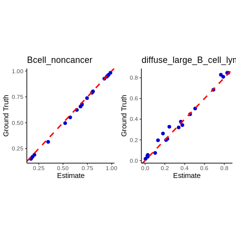

Houseman cell-type deconvolution analysis
================

Houseman et al. suggensted to a computational method to infer the white
blood cell distribution in cell-mixture samples wtih different
subpopulations. We applied his approach to our tumour pseudo-bulk data.

As houseman method is a reference-based method, we prepared five purce
samples for each B cell non-cancer and B cell lymphoma. *ref\_pheno*
contains cell-type proportion information (either 0.0 or 1.0 for pure
cell-type reference data) and *ref\_meth* contains methylation values at
each CpG and in each sample.

#### Reference data

``` r
head(ref_pheno)
```

    ##       Bcell_noncancer diffuse_large_B_cell_lymphoma
    ## ref_1               1                             0
    ## ref_2               1                             0
    ## ref_3               1                             0
    ## ref_4               1                             0
    ## ref_5               1                             0
    ## ref_6               0                             1

``` r
head(ref_meth)
```

    ##                     ref_1     ref_2     ref_3      ref_4     ref_5     ref_6
    ## chr10_134597393 0.4285714 0.4615385 0.3888889 0.42307692 0.3333333 1.0000000
    ## chr7_1268957    0.1136364 0.2000000 0.1025641 0.08695652 0.1162791 0.7812500
    ## chr21_38063872  0.2000000 0.3125000 0.2333333 0.21052632 0.2000000 0.7368421
    ## chr17_59472943  0.6875000 0.6666667 0.6428571 0.70000000 0.7647059 0.9375000
    ## chr5_170735031  0.3076923 0.2666667 0.2916667 0.30769231 0.3333333 0.2142857
    ## chr4_1395529    0.5833333 0.8000000 0.6000000 0.61538462 0.5000000 0.5454545
    ##                     ref_7     ref_8      ref_9    ref_10
    ## chr10_134597393 1.0000000 1.0000000 1.00000000 1.0000000
    ## chr7_1268957    0.7931034 0.7368421 0.75000000 0.7857143
    ## chr21_38063872  0.7500000 0.6666667 1.00000000 0.8181818
    ## chr17_59472943  0.9285714 0.9166667 1.00000000 0.9375000
    ## chr5_170735031  0.1818182 0.1153846 0.05882353 0.2400000
    ## chr4_1395529    0.6000000 0.5000000 0.75000000 0.8000000

#### Pseudo-bulk samples

We created a same matrix (CpGs x samples) for our pseudo-bulk samples as
a test
    dataset.

``` r
head(test_meth)
```

    ##                    bulk_1   bulk_10   bulk_11   bulk_12   bulk_13   bulk_14
    ## chr10_134597393 0.9090909 0.5882353 0.6363636 0.4210526 0.4545455 0.8000000
    ## chr7_1268957    0.8095238 0.3513514 0.3673469 0.1851852 0.1562500 0.7674419
    ## chr21_38063872  0.7000000 0.4210526 0.4482759 0.2500000 0.3000000 0.6000000
    ## chr17_59472943  0.9333333 0.8125000 0.8636364 0.8181818 0.7368421 0.8823529
    ## chr5_170735031  0.1818182 0.2307692 0.2272727 0.4166667 0.4285714 0.2121212
    ## chr4_1395529    0.6153846 0.0000000 0.3333333 0.8333333 0.6666667 0.6363636
    ##                    bulk_15   bulk_16   bulk_17   bulk_18   bulk_19    bulk_2
    ## chr10_134597393 0.40000000 0.5789474 0.8695652 0.5555556 0.5555556 0.4761905
    ## chr7_1268957    0.08333333 0.2380952 0.6792453 0.3170732 0.3414634 0.1851852
    ## chr21_38063872  0.29166667 0.4062500 0.7272727 0.4642857 0.6086957 0.2592593
    ## chr17_59472943  0.90000000 0.8125000 0.8333333 0.8000000 0.7692308 0.6666667
    ## chr5_170735031  0.31250000 0.2758621 0.1515152 0.2142857 0.2068966 0.3529412
    ## chr4_1395529    0.75000000 0.5000000 0.3333333 0.5000000 0.5000000 0.6666667
    ##                   bulk_20    bulk_3    bulk_4    bulk_5    bulk_6    bulk_7
    ## chr10_134597393 0.3333333 0.9500000 0.8148148 0.5555556 0.5000000 0.5000000
    ## chr7_1268957    0.1621622 0.8048780 0.7291667 0.4545455 0.3600000 0.3750000
    ## chr21_38063872  0.2500000 0.7000000 0.7307692 0.3809524 0.3181818 0.3043478
    ## chr17_59472943  0.8000000 0.9285714 0.9444444 0.8571429 0.8461538 0.8461538
    ## chr5_170735031  0.3125000 0.1666667 0.1891892 0.3750000 0.4375000 0.4285714
    ## chr4_1395529    0.2000000 0.6153846 0.6153846 0.7500000 0.8571429 0.8571429
    ##                    bulk_8    bulk_9
    ## chr10_134597393 0.6923077 0.6086957
    ## chr7_1268957    0.6315789 0.5294118
    ## chr21_38063872  0.5172414 0.3703704
    ## chr17_59472943  0.8421053 0.8750000
    ## chr5_170735031  0.2692308 0.3000000
    ## chr4_1395529    0.6666667 0.5833333

#### DMRs

For the deconvolution, we chose CpGs overlapping with differentially
methylated regions(DMRs) and ordered those with respect to methylation
difference.

    ## [1] "chr17_64960389" "chr7_149744127" "chr17_2627241"  "chr8_9762493"  
    ## [5] "chr5_121647223" "chr2_132795200"

    ## [1] "chr10_134597393" "chr7_1268957"    "chr21_38063872"  "chr17_59472943" 
    ## [5] "chr5_170735031"  "chr4_1395529"

## Houseman algorithm

We followed up the implementation attached as an additional file in the
paper. You can download the code below.

Code : *Additional file 2* in
<a href="url">https://bmcbioinformatics.biomedcentral.com/articles/10.1186/1471-2105-13-86</a>

#### Modeling setup

``` r
# Define validation model
ref_pheno$PLATE=sample(4671944001:5331044059, nrow(ref_pheno)) # We gave randome numbers for PLATE 
theModel = y~diffuse_large_B_cell_lymphoma+Bcell_noncancer # Linear model for our samples 
sizeModel = length(unique(ctypes))+1 #Number of coefficients in "theModel"

# Use only 500 top CpGs with respect to methylation value difference 
M = 500 
ref_meth = ref_meth[ordered_dmrs[1:M],] 
test_meth = test_meth[ordered_dmrs[1:M],]

# Linear transformation of coefficient vector
#  representing contrast to test F statistic
L.forFstat = diag(sizeModel)[-1,]  #All non-intercept coefficients
# Initialize various containers
sigmaResid = sigmaIcept = nObserved = nClusters = Fstat = rep(NA, M)
coefEsts = matrix(NA, M, sizeModel)
coefVcovs =list()
```

#### Linear model estimation

``` r
library(nlme)
for(j in 1:M){ # For each CpG
  
  #Remove missing methylation values
  ii = !is.na(ref_meth[j,])
  nObserved[j] = sum(ii)
  ref_pheno$y = unlist(ref_meth[j,])
  
  try({ # Try to fit a mixed model to adjust for plate
    fit = try(lme(theModel, random=~1|PLATE, data=ref_pheno[ii,]), silent = T)
    
    if(inherits(fit,"try-error")){ # If LME can't be fit, just use OLS
      fit = lm(theModel, data=ref_pheno[ii,])
      fitCoef = fit$coef
      sigmaResid[j] = summary(fit)$sigma
      sigmaIcept[j] = 0
      nClusters[j] = 0
    }
    else{  
      fitCoef = fit$coef$fixed
      sigmaResid[j] = fit$sigma
      sigmaIcept[j] = sqrt(getVarCov(fit)[1])
      nClusters[j] = length(fit$coef$random[[1]])
    }
    coefEsts[j,] = fitCoef
    coefVcovs[[j]] = vcov(fit)
    useCoef = L.forFstat %*% fitCoef
    useV = L.forFstat %*% coefVcovs[[j]] %*% t(L.forFstat)
    Fstat[j] = (t(useCoef) %*% solve(useV, useCoef))/sizeModel
  })
}

# Name the rows so that they can be easily matched to the target data set
rownames(coefEsts) = rownames(ref_meth[1:M,]) 
colnames(coefEsts) = names(fitCoef)
```

#### Model application for pseudo-bulk samples

``` r
####### Projections for mixture experiment data

source("wbcInference.R")
Lwbc = diag(sizeModel)[-1,] 
Lwbc[,1] = 1; #Lwbc[1:2,2] = 1 ; # First column is "interception"
rownames(Lwbc) = colnames(coefEsts)[-1]
colnames(Lwbc) = colnames(coefEsts)

Lwbc # View contrast matrix
```

    ##                               (Intercept) diffuse_large_B_cell_lymphoma
    ## diffuse_large_B_cell_lymphoma           1                             1
    ## Bcell_noncancer                         1                             0
    ##                               Bcell_noncancer
    ## diffuse_large_B_cell_lymphoma               0
    ## Bcell_noncancer                             1

``` r
test_meth <- test_meth[rownames(test_meth) %in% rownames(ref_meth),]
CpGSelection = rownames(coefEsts)[1:M] # Use the top 100
ObsMix = projectWBC(
    test_meth,
    coefEsts[CpGSelection,-ncol(coefEsts)], # due to NA value of linear model 
    Lwbc[, -ncol(Lwbc)])

test_gt = as.data.frame(test_gt)
ExMix = matrix(0, nrow(test_gt), length(unique(ctypes)))
colnames(ExMix) = unique(ctypes)
for(i in 1:nrow(test_gt)){
  for(ctype in unique(ctypes)){
    ExMix[i, ctype] = test_gt[i, ctype]
  }
}

colnames(ExMix) = unique(ctypes)
rownames(ExMix) = rownames(test_gt)
ObsMix = ObsMix[rownames(ExMix), colnames(ExMix)]
```

## Cell-type deconvolution results

    ##         Bcell_noncancer_estimate Bcell_noncancer_gt
    ## bulk_1                      15.1               16.8
    ## bulk_10                     65.7               67.9
    ## bulk_11                     55.2               57.4
    ## bulk_12                     96.3               96.8
    ## bulk_13                     95.5               95.9
    ## bulk_14                     31.5               34.7
    ##         diffuse_large_B_cell_lymphoma_estimate diffuse_large_B_cell_lymphoma_gt
    ## bulk_1                                    84.9                             82.9
    ## bulk_10                                   34.3                             37.7
    ## bulk_11                                   44.8                             45.5
    ## bulk_12                                    3.7                              2.6
    ## bulk_13                                    4.5                              2.4
    ## bulk_14                                   68.5                             69.0

<!-- -->
